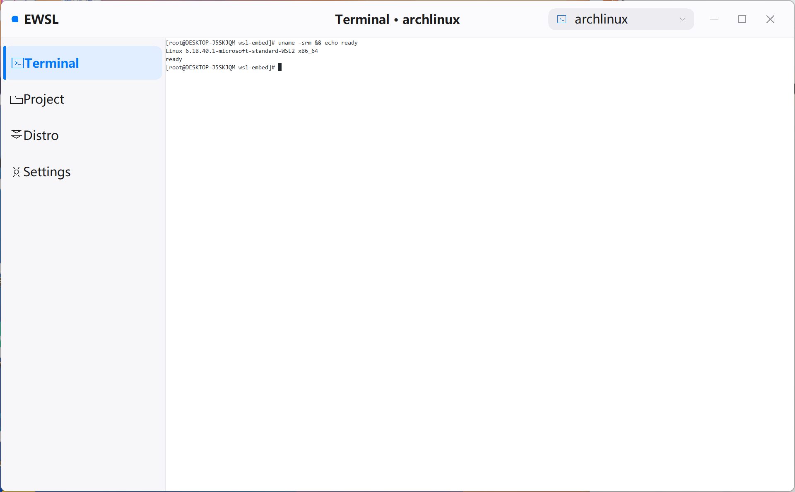
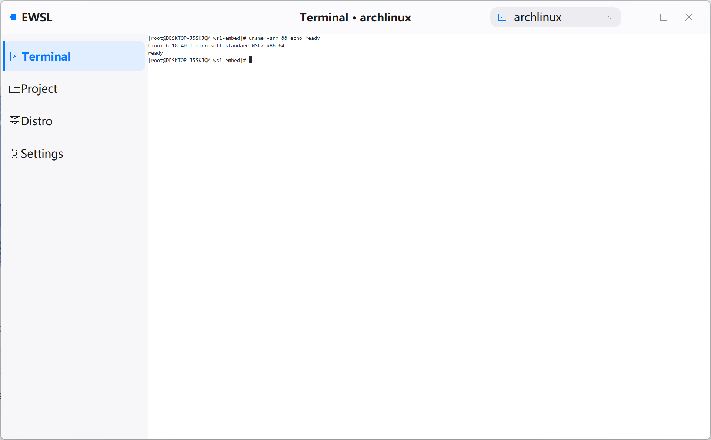
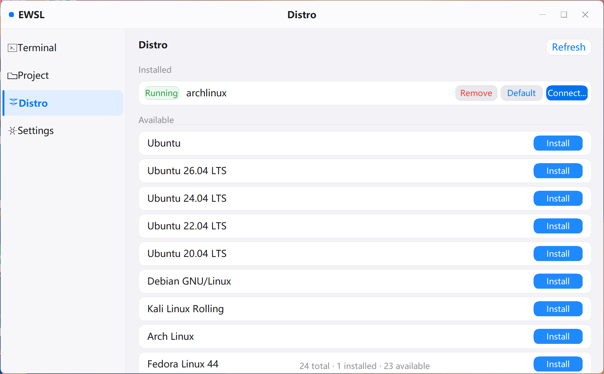
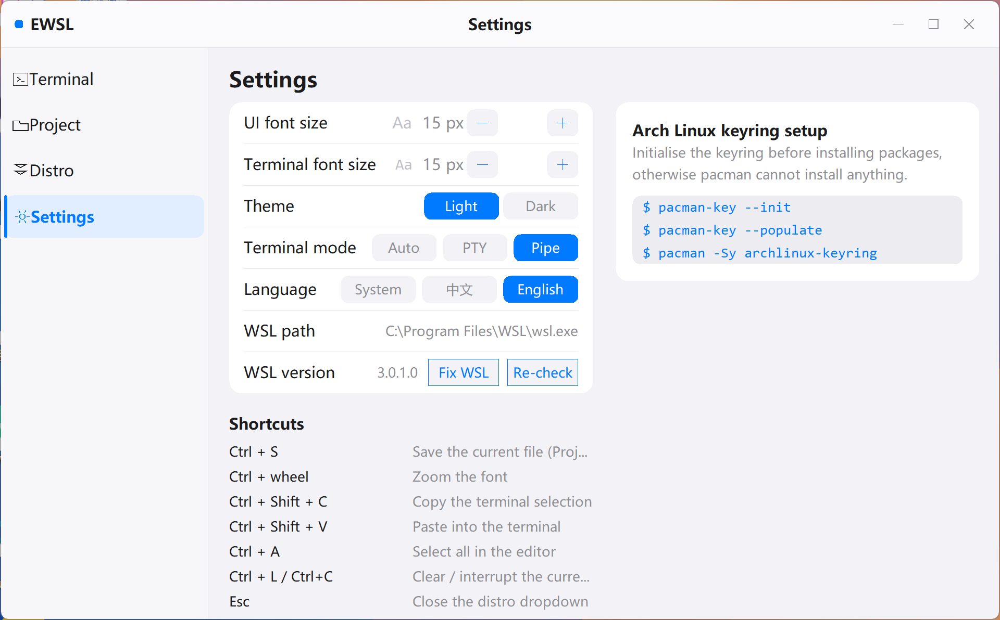
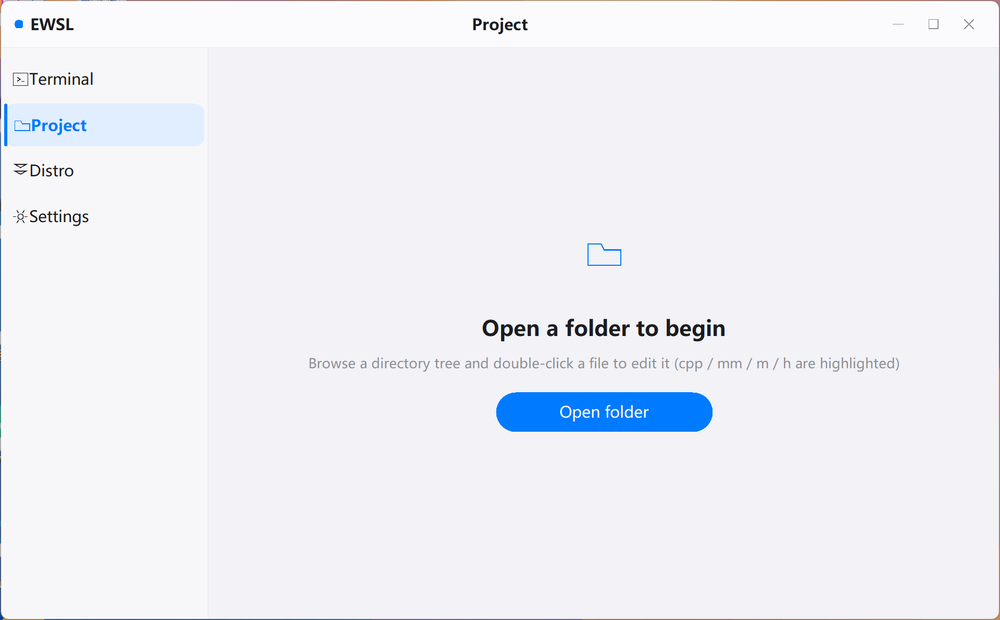

# EWSL

WSL distro installs, a terminal and an editor, in one native Win32 window. Single file, ~1 MB, no
runtime dependencies.

[中文](README.md) · [MIT License](LICENSE)



## What this is

Most WSL GUIs stop at management: start, stop, unregister, migrate. To actually run a command you still
end up in Windows Terminal. And installing a distro means either the Microsoft Store or a wall of
`wsl --install` output scrolling past in a console.

EWSL puts both in the same window. Installation gets its own page with a progress bar, and the terminal
is right there once it finishes.

Four items in the sidebar: Terminal / Project / Distro / Settings.

## Installing a distro

23 distros are built in (Ubuntu releases, Debian, Kali, Arch, Fedora, openSUSE, AlmaLinux, ...). An
install runs in four steps:

1. **Resolve the image URL** — pull the `.wsl` direct link out of Microsoft's `DistributionInfo.json`
   and pick amd64 or arm64 for this machine
2. **Download** — WinHTTP, redirects followed, live progress / speed / remaining, cancellable. Error
   codes are turned into plain words (DNS failure / cannot connect / timeout / certificate error)
3. **Import into WSL** — `wsl --import`, falling back to WSL1 if that fails
4. **Register and start** — re-list the distros to confirm it showed up before launching it

None of this goes through the terminal. The sidebar locks while an install is running so a page switch
cannot disturb the state machine. The handful of entries Microsoft publishes no direct link for
(Oracle Linux, SUSE) fall back to the official `wsl --install` path.

## Terminal

The ANSI parser is written from scratch — no terminal emulator library. 16 / 256 / true colour, bold,
dim, italic, underline, reverse, strikethrough; cursor movement, scroll regions, erase, insert and
delete lines, alternate screen; UTF-8 decoding with CJK double-width handling, scrollback, mouse wheel;
drag-select with `Ctrl + Shift + C/V`.

There are three backends. The default "Auto" prefers ConPTY and drops back to pipes if nothing comes
out within six seconds. "Compatible" starts a real PTY inside the guest and bridges to it, which keeps
`vim` and `top` usable in environments where ConPTY child processes die on startup.

## Editor

The Project page is a directory tree on the left and an editor on the right. Line numbers, current-line
highlight, selection, both scrollbars. UTF-8 / UTF-8 BOM / UTF-16 LE / UTF-16 BE are detected and kept
on save. Syntax highlighting covers C / C++ / ObjC / Swift plus json / yaml / toml / md / html / sh /
py and more.

## Settings

| Item | Notes |
|---|---|
| UI font size | 10–32 px |
| Terminal font size | 8–40 px, or `Ctrl + wheel` |
| Theme | Light / dark, applied everywhere |
| Terminal mode | Auto / PTY / Compatible |
| Language | System / 中文 / English |
| WSL path | Read-only, the detected `wsl.exe` |
| WSL version | Version, plus Fix WSL (`wsl --update`) and Re-check |

The UI language follows the system by default — Chinese on a Chinese Windows, English anywhere else —
and can be overridden here. Settings live in `%APPDATA%\WslEmbed\settings.ini`.

## Screenshots

<table>
<tr>
<td width="50%"><br><sub>The distro button in the title bar opens the installed / available list</sub></td>
<td width="50%"><br><sub>Distro management page: connect / set default / remove</sub></td>
</tr>
<tr>
<td width="50%"><br><sub>Settings, with the Arch keyring hint on the right</sub></td>
<td width="50%"><br><sub>Project page: directory tree and syntax-highlighted editor</sub></td>
</tr>
</table>

## Shortcuts

| Key | Action |
|---|---|
| `Ctrl + Shift + C` / `V` | Copy / paste the terminal selection |
| `Ctrl + L` / `Ctrl + C` | Clear the screen / interrupt the current command |
| `Ctrl + S` / `Ctrl + A` | Save the file / select all in the editor |
| `Ctrl + wheel` | Zoom the font |
| `Shift + arrows` | Extend the editor selection |
| `Esc` | Close the distro dropdown |

Command line:

```
EWSL.exe                 start the default distro
EWSL.exe -d archlinux    use a specific distro
EWSL.exe --help          help
```

## Requirements

- Windows 10 2004 or newer / Windows 11, with WSL2 enabled
- Installing from a `.wsl` direct link needs WSL 2.4.4 or newer; older builds get a note on the
  install page
- No runtime dependencies — the exe is a statically linked single file

The exe is not code-signed, so SmartScreen will ask once on the first run
("More info → Run anyway"). A borderless self-drawn window that spawns `wsl.exe` can also draw
attention from antivirus tools; the full source is in this repository if that bothers you.

## Download

Grab `EWSL.exe` from [Releases](../../releases) and run it. No installer.

## Building

All you need is **zig**, which ships its own mingw-w64 headers and import libraries. The icon step
additionally wants **Python + Pillow**:

```bash
git clone <repo>
cd EWSL
python -m pip install pillow
ZIG=/path/to/zig ./build-zig.sh      # -> dist/EWSL.exe
```

`build-zig.sh` ends by calling `tools/make-rsrc.py`, which re-encodes `icon.jpg` into eight icon sizes
and patches them into the PE resource section. Without Python it prints a warning and skips that step —
the exe still runs, just without an icon. `make` works too if you already have MinGW-w64 installed.

After changing any UI string, run `python tools/i18n.py`: it wraps the new literals in `LS(...)` and
lists the keys that are missing from — or no longer used by — the table in `src/lang.cpp`.

## Known limits

- The editor has no undo / redo or find-and-replace, and refuses files above 64 MB
- Long lines do not wrap; scroll horizontally instead
- Installation needs a network. Set `WSLEMBED_IMAGE_URL` to a local HTTP server to exercise the whole
  flow offline

## License

[MIT](LICENSE)
