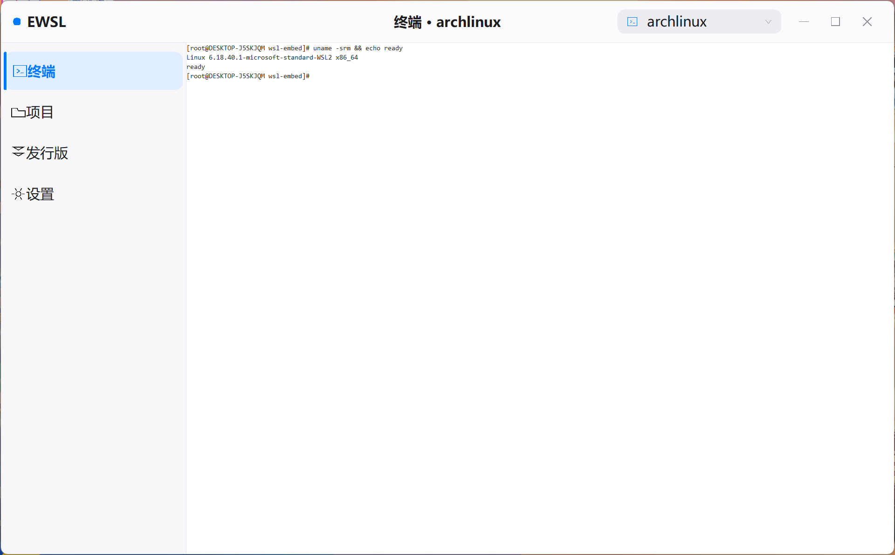
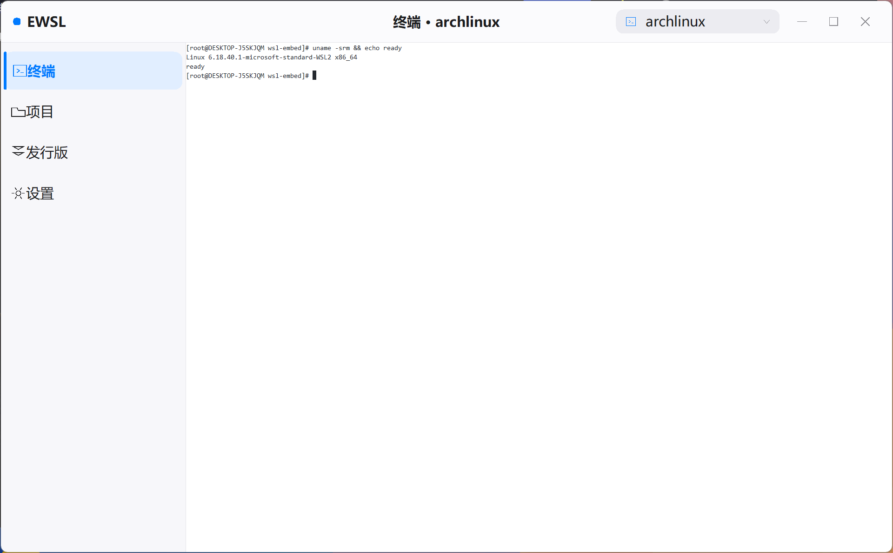
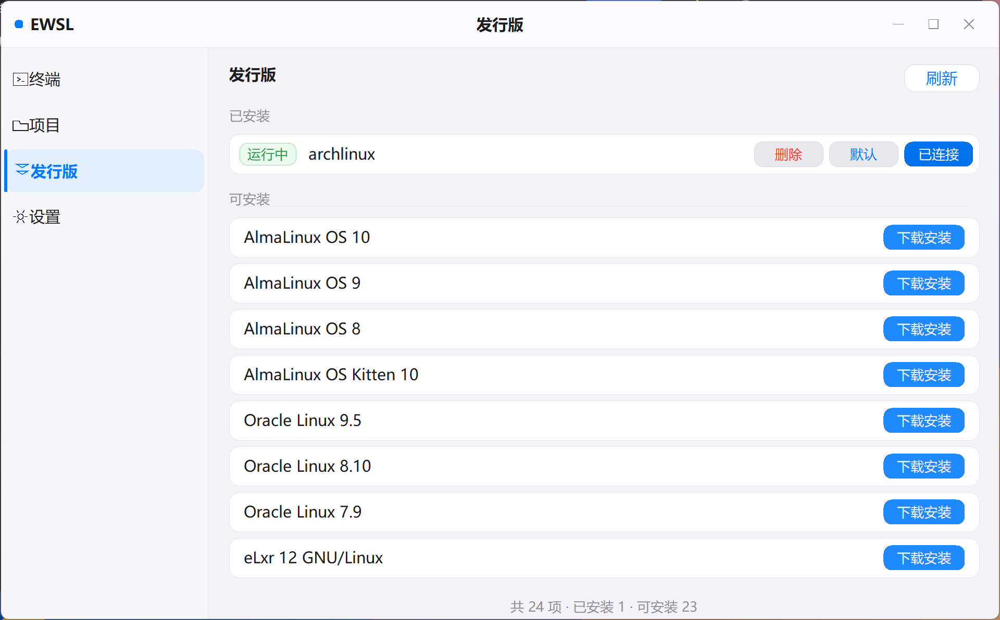
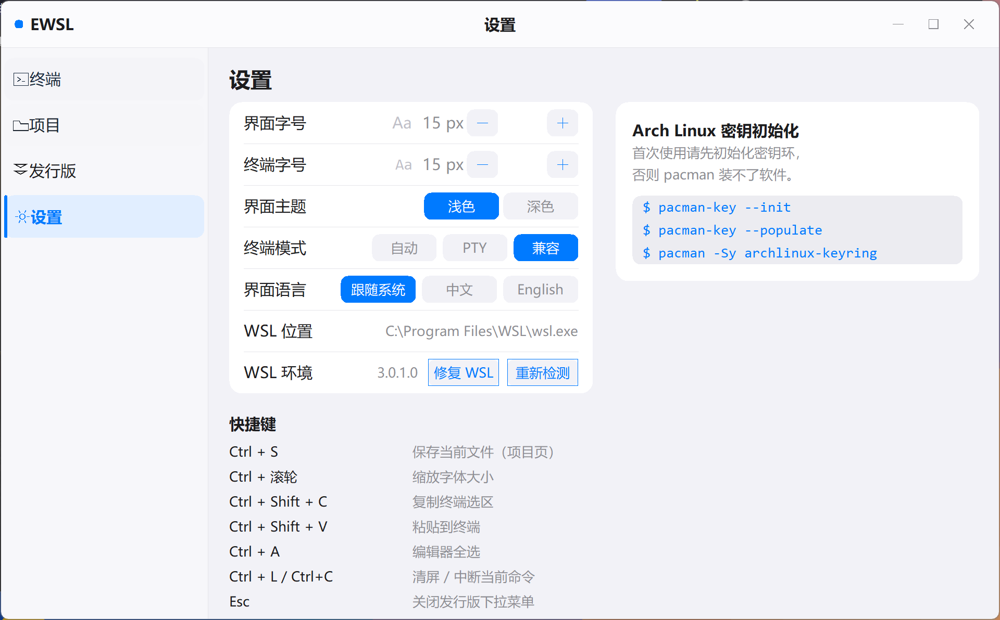
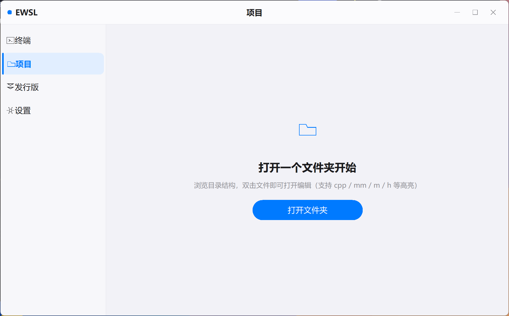

# EWSL

把 WSL 发行版的安装、终端和编辑器装进一个原生 Win32 窗口。单文件，约 1 MB，没有运行时依赖。

[English](README.en.md) · [MIT License](LICENSE)



## 这是个什么

WSL 的图形工具大多停在「管理」这一层：启停、注销、迁移、端口转发。想敲命令还是得跳回
Windows Terminal；而装一个发行版，走的要么是 Microsoft Store，要么是 `wsl --install`
那一屏一闪而过的控制台输出。

EWSL 把这两件事都收进同一个窗口——装的时候有独立页面和进度条，装完直接就能在同一个窗口里用。

侧边栏只有四项：终端 / 项目 / 发行版 / 设置。

## 装发行版

内置 23 个常用发行版（Ubuntu 各版本、Debian、Kali、Arch、Fedora、openSUSE、AlmaLinux……），
点「下载安装」后走四步：

1. **解析镜像地址** —— 从微软的 `DistributionInfo.json` 取 `.wsl` 直链，按本机架构选 amd64 / arm64
2. **下载镜像** —— WinHTTP 直连并跟随跳转，进度、速度、剩余量实时更新，随时能取消；失败会把
   错误码翻成人话（域名解析失败 / 无法连接 / 超时 / 证书错误）
3. **导入 WSL** —— `wsl --import`，失败自动降级到 WSL1 重试
4. **注册并启动** —— 重新探测确认发行版出现，成功才启动

整个过程显示在专门的安装页里，不会把 `wsl --install` 的输出滚进终端。安装期间侧边栏会锁住，
免得切页把状态机搞乱。微软没有公开直链的那几个（Oracle Linux、SUSE）走官方通道兜底。

## 终端

ANSI 是自己解析的，没用任何终端模拟器库：16 色 / 256 色 / 真彩色，加粗、斜体、下划线、反显、
删除线；光标控制、滚动区域、擦除、插入删除行列、备用屏缓冲；UTF-8 解码带 CJK 双宽处理、回滚
历史、鼠标滚轮翻页；拖拽选区配 `Ctrl + Shift + C/V` 复制粘贴。

通道分三档。默认的「自动」优先用 ConPTY，六秒没有输出就自动切管道重试；「兼容」档会在 guest
里起一个真 PTY 再桥接回来——受控环境下 ConPTY 拉起的子进程可能直接退出，这时 `vim`、`top`
这类全屏程序照样能用。

## 编辑器

「项目」页左边目录树、右边编辑器。行号、当前行高亮、选区、水平和垂直滚动；自动识别
UTF-8 / UTF-8 BOM / UTF-16 LE / UTF-16 BE 并在保存时沿用；语法高亮覆盖
C / C++ / ObjC / Swift，以及 json / yaml / toml / md / html / sh / py 等。

## 设置

| 项目 | 说明 |
|---|---|
| 界面字号 | 10–32 px |
| 终端字号 | 8–40 px，也可以 `Ctrl + 滚轮` |
| 界面主题 | 浅色 / 深色，全局生效 |
| 终端模式 | 自动 / PTY / 兼容 |
| 界面语言 | 跟随系统 / 中文 / English |
| WSL 位置 | 只读，显示探测到的 `wsl.exe` 路径 |
| WSL 环境 | WSL 版本号、修复 WSL（`wsl --update`）、重新检测 |

界面语言默认跟随系统：中文系统显示中文，其它显示英文，也可以在设置里手动指定。配置写在
`%APPDATA%\WslEmbed\settings.ini`。

## 截图

<table>
<tr>
<td width="50%"><br><sub>点标题栏的发行版按钮，弹出「已安装 / 可安装」浮层</sub></td>
<td width="50%"><br><sub>发行版管理页：连接 / 设为默认 / 删除</sub></td>
</tr>
<tr>
<td width="50%"><br><sub>设置页，右侧带 Arch 密钥初始化提示</sub></td>
<td width="50%"><br><sub>项目页：目录树 + 带语法高亮的编辑器</sub></td>
</tr>
</table>

深色主题：`docs/ui-terminal-dark.png`、`docs/ui-settings-dark.png`。

## 快捷键

| 按键 | 作用 |
|---|---|
| `Ctrl + Shift + C` / `V` | 终端复制 / 粘贴选区 |
| `Ctrl + L` / `Ctrl + C` | 清屏 / 中断当前命令 |
| `Ctrl + S` / `Ctrl + A` | 保存文件 / 编辑器全选 |
| `Ctrl + 滚轮` | 缩放字号 |
| `Shift + 方向键` | 编辑器扩展选区 |
| `Esc` | 关闭发行版浮层 |

命令行参数：

```
EWSL.exe                 启动默认发行版
EWSL.exe -d archlinux    指定发行版
EWSL.exe --help          帮助
```

## 运行要求

- Windows 10 2004 以上或 Windows 11，已启用 WSL2
- 用 `.wsl` 直链安装需要 WSL 2.4.4 以上，更旧的版本安装页会给出提示
- 无运行时依赖，exe 是静态链接的单文件

exe 没有代码签名证书，第一次运行 SmartScreen 会拦一下（「更多信息 → 仍要运行」）。自绘无边框
窗口加上拉起 `wsl.exe` 的组合也可能被杀软挑出来，介意的话请自己构建。

## 下载

到 [Releases](../../releases) 下载 `EWSL.exe`，双击就能跑，不用安装。

## 自己构建

依赖只有 **zig**（自带 mingw-w64 头文件和导入库），图标那一步额外需要 **Python + Pillow**：

```bash
git clone <仓库地址>
cd EWSL
python -m pip install pillow
ZIG=/path/to/zig ./build-zig.sh      # -> dist/EWSL.exe
```

`build-zig.sh` 最后会调 `tools/make-rsrc.py`，把 `icon.jpg` 转成 8 档图标写进 PE 的资源节。
本机没有 Python 时它会打印一条警告并跳过，产物没图标但能正常跑。已经有 MinGW-w64 的话，
用 `make` 也可以。

改完界面文案之后，跑一遍 `python tools/i18n.py` 会把新串包上 `LS(...)` 并列出 `src/lang.cpp`
里漏译和多译的条目。

## 已知限制

- 编辑器没有撤销 / 重做和查找替换，大文件（> 64 MB）打不开
- 长行不自动换行，得横向滚
- 安装依赖网络；离线调试可以设环境变量 `WSLEMBED_IMAGE_URL` 指向本地 HTTP 服务

## 许可

[MIT](LICENSE)
